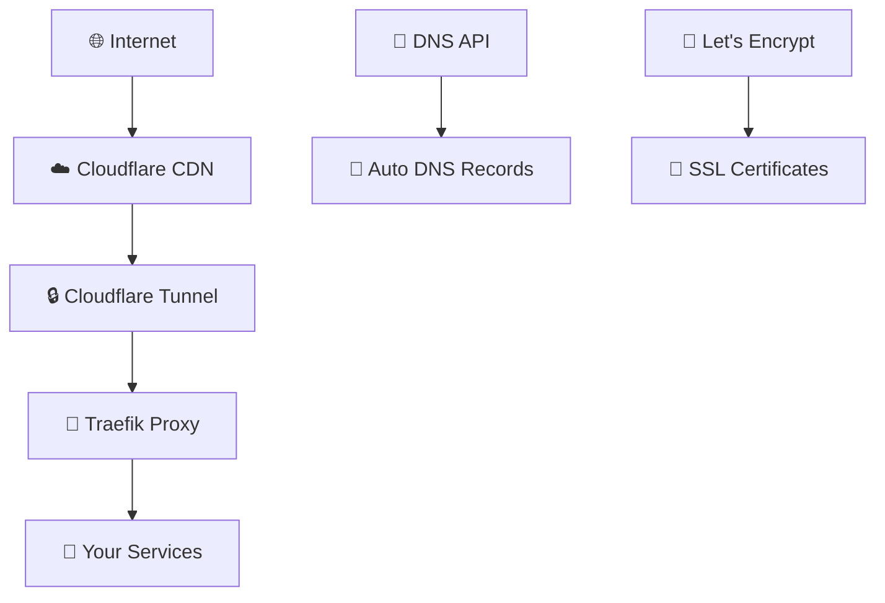

# 🚀 Traefik Tunnel Expose

<div align="center">


[](https://hub.docker.com/r/zenkiet/traefik-tunnel-expose)
[](https://hub.docker.com/r/zenkiet/traefik-tunnel-expose)
[](https://hub.docker.com/r/zenkiet/traefik-tunnel-expose/tags)
[](https://github.com/zenkiet/traefik-tunnel-expose/actions)
[](LICENSE)
[](https://github.com/zenkiet/traefik-tunnel-expose/stargazers)

**🌐 A powerful Docker solution combining Traefik reverse proxy with Cloudflare Tunnel**
*Expose your local services to the internet securely with automatic SSL and DNS management*

[🐳 Docker Hub](https://hub.docker.com/r/zenkiet/traefik-tunnel-expose) • [🚀 Quick Start](#-quick-start) • [💬 Discussions](https://github.com/zenkiet/traefik-tunnel-expose/discussions)

</div>

---

## 📋 Table of Contents

- [✨ Features](#-features)
- [🏗️ Architecture](#️-architecture)
- [🚀 Quick Start](#-quick-start)
- [⚙️ Service Configuration](#️-service-configuration)
- [🔐 Cloudflare Setup](#-cloudflare-setup)
- [🔧 Advanced Configuration](#-advanced-configuration)
- [🐳 Docker Usage](#-docker-usage)
- [🤝 Contributing](#-contributing)
- [📄 License](#-license)
- [🙏 Acknowledgments](#-acknowledgments)
- [📞 Support](#-support)

---

## ✨ Features

<table>
<tr>
<td width="50%">

### ⚡ **Core Features**

- 🔄 **Traefik v3** - Modern reverse proxy with service discovery
- ☁️ **Cloudflare Tunnel** - Secure tunneling without port forwarding
- 🔒 **Auto SSL** - Let's Encrypt certificates with DNS challenge
- 🤖 **DNS Management** - Automatic subdomain creation
- 🔧 **Hot Reload** - Zero-downtime configuration updates
- 📱 **Gotify Notification** - Send notifications to your phone
- 📦 **Multi-architecture** - Build for multiple platforms
- 🔄 **Auto Update** - Update latest version automatically

</td>
<td width="50%">

### 🛡️ **Security & Performance**

- 📊 **Real-time Dashboard** - Monitor services and metrics
- 🔐 **End-to-end Encryption** - Secure tunnel connection
- 🚫 **No Port Opening** - Firewall-friendly architecture
- ⚡ **Load Balancing** - Distribute traffic efficiently
- 🎯 **Middleware Support** - Rate limiting, headers, auth
- 📝 **Comprehensive Logging** - Access and error logs
- 🐳 **Lightweight** - Alpine Linux based container

</td>
</tr>
</table>

---

## 🏗️ Architecture



**Flow Overview:**

1. 🌍 **Internet Traffic** → Cloudflare CDN for caching and protection
2. 🔒 **Secure Tunnel** → Encrypted connection through Cloudflare Tunnel
3. 🚀 **Traefik Proxy** → Intelligent routing to your services
4. 🤖 **Automatic SSL** → Let's Encrypt certificates via DNS challenge
5. 📝 **DNS Management** → Auto-create subdomains for services

---

## 🚀 Quick Start

### 📦 Prerequisites

- 🐳 Docker & Docker Compose
- ☁️ Cloudflare account with domain
- 🔑 Cloudflare API tokens

### 1️⃣ Clone Repository

```bash
git clone https://github.com/zenkiet/traefik-tunnel-expose.git
cd traefik-tunnel-expose
```

### 2️⃣ Environment Setup

```bash
# Copy example environment file
cp env.example .env

# Edit configuration
nano .env  # or your preferred editor
```

#### 🔧 Required Environment Variables

```bash
# User/Group Identifiers
# These help avoid permission issues between host and container
PUID=1000
PGID=1000
UMASK=022

# Container name prefix
CONTAINER_PREFIX=

# Paths for persistent data
CONFIG_PATH=/opt/appdata/config
DATA_PATH=/opt/appdata/data

# Container settings
TZ=Asia/Ho_Chi_Minh
RESTART_POLICY=unless-stopped
NETWORK_MODE=bridge

# ===== REQUIRED =====
HOST=127.0.0.1
BASE_DOMAIN=zenkiet.dev
TAG=latest

# =============================================================================
# AUTO UPDADTE
# =============================================================================
AUTO_UPDATE=TRUE
GOTIFY_URL=
GOFITY_TOKEN=


# =============================================================================
# CLOUDFLARE TUNNEL
# =============================================================================
CF_ENABLED=true
CF_ZONE_API_TOKEN=your_cloudflare_zone_api_token_here
CF_ZONE_ID=your_cloudflare_zone_id
CF_TUNNEL_ID=your_cloudflare_tunnel_id
CF_ACCOUNT_ID=your_cloudflare_account_id
CF_TUNNEL_SECRET=your_cloudflare_account_secret_id
CF_API_EMAIL=kietgolx65234@gmail.com
ACME_CA_SERVER=https://acme-staging-v02.api.letsencrypt.org/directory

#! For production, use:
# ACME_CA_SERVER=https://acme-v02.api.letsencrypt.org/directory
```

### 3️⃣ Deploy services

```bash
# 🚀 Start services
make up

# 📊 Check status
make status
```

### 4️⃣ Access Dashboard

- 🎛️ **Traefik Dashboard**: <http://127.0.0.1:8080>
- 🌐 **Your Services**: <https://service.yourdomain.com>

---

## ⚙️ Service Configuration

### 📁 Adding New Services

Create configuration files in `conf.d/` directory:

#### 📄 Example: `conf.d/myapp.yml`

```yaml
# 🚀 HTTP Router and Service Configuration
http:
  routers:
    myapp:
      rule: "Host(`myapp.yourdomain.com`)"
      service: "myapp-service"
      entrypoints:
        - websecure
      tls:
        certResolver: cloudflare
      middlewares:
        - default-headers
        - rate-limit

  services:
    myapp-service:
      loadBalancer:
        servers:
          - url: "http://myapp-container:3000"
        healthCheck:
          path: "/health"
          interval: "30s"

  middlewares:
    default-headers:
      headers:
        frameDeny: true
        sslRedirect: true
        browserXssFilter: true
        contentTypeNosniff: true
        forceSTSHeader: true
        stsIncludeSubdomains: true
        stsPreload: true
        stsSeconds: 31536000

    rate-limit:
      rateLimit:
        burst: 100
        average: 50
```

#### 🔧 Advanced Service Configuration

<details>
<summary>📱 <b>Web Application with Authentication</b></summary>

```yaml
http:
  routers:
    webapp-secure:
      rule: "Host(`webapp.yourdomain.com`)"
      service: "webapp"
      entrypoints:
        - websecure
      tls:
        certResolver: cloudflare
      middlewares:
        - auth
        - secure-headers

  services:
    webapp:
      loadBalancer:
        servers:
          - url: "http://webapp:8080"

  middlewares:
    auth:
      basicAuth:
        users:
          - "admin:$2y$12$..."  # Generated with htpasswd

    secure-headers:
      headers:
        accessControlAllowMethods:
          - GET
          - OPTIONS
          - PUT
        accessControlAllowOriginList:
          - https://yourdomain.com
        accessControlMaxAge: 100
        hostsProxyHeaders:
          - "X-Forwarded-Host"
```

</details>

<details>
<summary>🗄️ <b>Database Service (Internal Only)</b></summary>

```yaml
http:
  routers:
    db-admin:
      rule: "Host(`db.yourdomain.com`)"
      service: "database-admin"
      entrypoints:
        - websecure
      tls:
        certResolver: cloudflare
      middlewares:
        - ip-whitelist
        - auth

  services:
    database-admin:
      loadBalancer:
        servers:
          - url: "http://adminer:8080"

  middlewares:
    ip-whitelist:
      ipWhiteList:
        sourceRange:
          - "192.168.1.0/24"
          - "10.0.0.0/8"
```

</details>

---

## 🔐 Cloudflare Setup

### 1️⃣ API Token Creation

1. 🌐 Navigate to [Cloudflare API Tokens](https://dash.cloudflare.com/profile/api-tokens)
2. 🔧 Create Custom Token with permissions:

| **Scope** | **Resource** | **Permission** |
|-----------|--------------|----------------|
| Zone | Zone:Read | Specific zones |
| Zone | DNS:Edit | Specific zones |
| Account | Cloudflare Tunnel:Edit | Specific accounts |

3. 📋 Copy the generated token

### 2️⃣ Cloudflare Tunnel Setup

#### 🖥️ Using cloudflared CLI (Recommended [here](https://developers.cloudflare.com/cloudflare-one/connections/connect-apps/install-and-setup/installation/))

```bash
# 📥 Install cloudflared
curl -L https://github.com/cloudflare/cloudflared/releases/latest/download/cloudflared-linux-amd64.deb -o cloudflared.deb
sudo dpkg -i cloudflared.deb

# 🔐 Authenticate with Cloudflare
cloudflared tunnel login

# 🚇 Create tunnel
cloudflared tunnel create my-tunnel

# 🎫 Generate tunnel token
cloudflared tunnel token my-tunnel

# 📋 Print tunnel info
cloudflared tunnel info my-tunnel
```

```json
{
  "Tunnel": "your-tunnel-id", # CF_TUNNEL_ID
  "AccountTag": "your-account-tag", # CF_ACCOUNT_ID
  "TunnelToken": "your-tunnel-token" # CF_TUNNEL_TOKEN
}
```

#### 🌐 Method 2: Using Cloudflare Dashboard

1. Go to **Zero Trust** → **Networks** → **Tunnels**
2. Create new tunnel
3. Install connector and copy the token

### 3️⃣ Generate credentials file

```bash
cloudflared tunnel token --cred-file ./credentials.json <TUNNEL_ID>
```

```json
{
  "Tunnel": "your-tunnel-id", # CF_TUNNEL_ID
  "AccountTag": "your-account-tag", # CF_ACCOUNT_ID
  "TunnelToken": "your-tunnel-token" # CF_TUNNEL_TOKEN
}
```

### 4️⃣ DNS Configuration

The service automatically creates DNS records, but you can manually verify:

```bash
# 🔍 Check DNS records
dig myapp.yourdomain.com
nslookup myapp.yourdomain.com
```

---

## 📊 Management Commands

Using `make help` to see all commands or `make <command>` to run a specific command.
---

## 🔧 Advanced Configuration

### 🎛️ Custom Traefik Configuration

<details>
<summary>⚡ <b>Custom Traefik Configuration</b></summary>

Create `config/traefik-dynamic.yml` for advanced settings:

```yaml
# 🔐 TLS Configuration
tls:
  options:
    default:
      sslProtocols:
        - "TLSv1.2"
        - "TLSv1.3"
      cipherSuites:
        - "TLS_ECDHE_RSA_WITH_AES_256_GCM_SHA384"
        - "TLS_ECDHE_RSA_WITH_CHACHA20_POLY1305"
        - "TLS_ECDHE_RSA_WITH_AES_128_GCM_SHA256"

# 📊 Global Middlewares
http:
  middlewares:
    secure-headers:
      headers:
        accessControlAllowMethods:
          - GET
          - OPTIONS
          - PUT
        accessControlMaxAge: 100
        hostsProxyHeaders:
          - "X-Forwarded-Host"
        referrerPolicy: "same-origin"
```

</details>

### 🚀 Performance Optimization

<details>
<summary>⚡ <b>Performance Tuning</b></summary>

```yaml
services:
  traefik-tunnel:
    deploy:
      resources:
        limits:
          cpus: '2.0'
          memory: 1G
        reservations:
          cpus: '0.5'
          memory: 256M
    healthcheck:
      test: ["CMD", "traefik", "healthcheck"]
      interval: 30s
      timeout: 10s
      retries: 3
      start_period: 40s
```

</details>

---

## 🐳 Docker Usage

### 📥 Pull from Docker Hub

```bash
# 🎯 Latest version
docker pull zenkiet/traefik-tunnel-expose:latest

# 🏷️ Specific version
docker pull zenkiet/traefik-tunnel-expose:v1.0.0

# 📊 Check image info
docker inspect zenkiet/traefik-tunnel-expose:latest
```

### 🚀 Quick Run (Standalone)

```bash
docker run -d \
  --name traefik-tunnel \
  --restart unless-stopped \
  -p 80:80 \
  -p 443:443 \
  -p 8080:8080 \
  -v /var/run/docker.sock:/var/run/docker.sock:ro \
  -v ./data:/data \
  -v ./config:/etc/traefik \
  -e CF_API_TOKEN=your_token \
  -e CF_ZONE_ID=your_zone_id \
  zenkiet/traefik-tunnel-expose:latest
```

---

## 🤝 Contributing

We welcome contributions! Here's how you can help:

### 🐛 Bug Reports

1. 🔍 Search existing issues
2. 📝 Create detailed bug report
3. 🏷️ Use appropriate labels

### ✨ Feature Requests

1. 💡 Discuss in GitHub Discussions
2. 📋 Create feature request issue
3. 🚀 Submit pull request

### 🛠️ Development Workflow

```bash
# 🍴 Fork and clone
git clone https://github.com/your-username/traefik-tunnel-expose.git
cd traefik-tunnel-expose

# 🌿 Create feature branch
git checkout -b feature/amazing-feature

# 🔧 Make changes and test
docker-compose up -d

# ✅ Commit changes
git commit -m "✨ Add amazing feature"

# 🚀 Push and create PR
git push origin feature/amazing-feature
```

### 📝 Commit Convention

We use [Conventional Commits](https://www.conventionalcommits.org/):

- `✨ feat:` New features
- `🐛 fix:` Bug fixes
- `📚 docs:` Documentation
- `🎨 style:` Code formatting
- `♻️ refactor:` Code restructuring
- `⚡ perf:` Performance improvements
- `✅ test:` Testing
- `🔧 chore:` Maintenance

---

## 📄 License

This project is licensed under the **MIT License** - see the [LICENSE](LICENSE) file for details.

```
MIT License

Copyright (c) 2025 ZenKiet
```

---

## 🙏 Acknowledgments

This project wouldn't be possible without these amazing technologies:

<table>
<tr>
<td align="center" width="150px">

<br><strong>Traefik</strong>
<br><em>Reverse Proxy</em>
</td>
<td align="center" width="150px">

<br><strong>Cloudflare</strong>
<br><em>Tunnel & Security</em>
</td>
<td align="center" width="150px">

<br><strong>Alpine Linux</strong>
<br><em>Lightweight OS</em>
</td>
<td align="center" width="150px">

<br><strong>Docker</strong>
<br><em>Containerization</em>
</td>
</tr>
</table>

### 🎯 Special Thanks

- **[Proxmox](https://proxmox.com/)** - For excellent virtualization platform
- **[chatgpt](https://chatgpt.com)** - For best research
- **Open Source Community**

---

## 📞 Support

<div align="center">

### 🤝 Get Help & Connect

[](mailto:zenkiet0906@gmail.com)
[](https://github.com/zenkiet/traefik-tunnel-expose/issues)
[](https://github.com/zenkiet/traefik-tunnel-expose/discussions)
[](https://hub.docker.com/r/zenkiet/traefik-tunnel-expose)

### 📊 Project Stats


</div>

---

<div align="center">

**⭐ If this project helped you, please consider giving it a star! ⭐**

*Made with ❤️ by [ZenKiet](https://github.com/zenkiet)*

</div>
